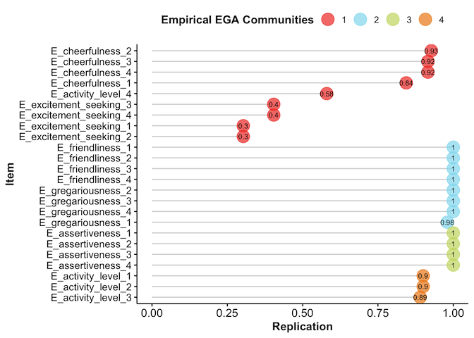

# Psychometric Grouping
This project uses clustering to analyze differing levels of extraversion across countries. International Personality Item Pool (IPIP) study data is processed using exploratory graph analysis.

