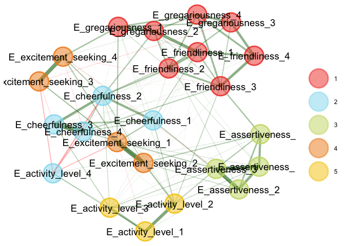
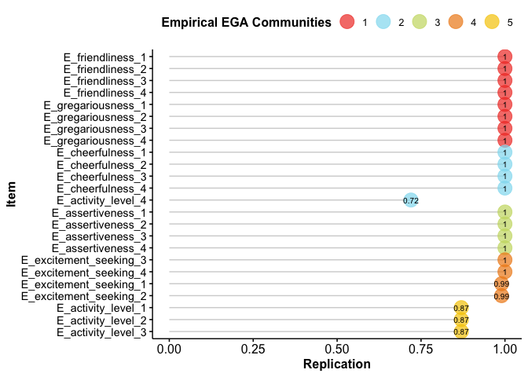
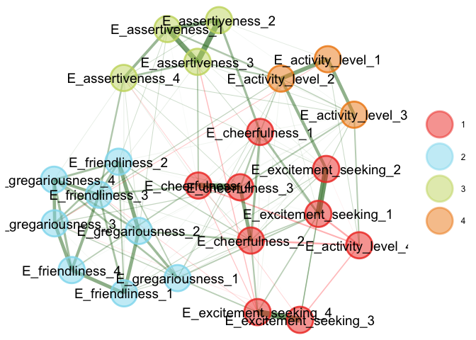
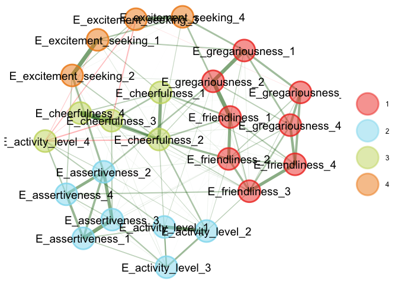
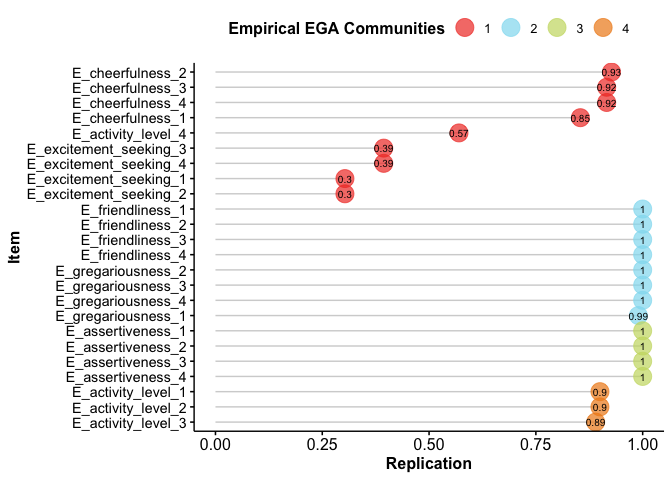
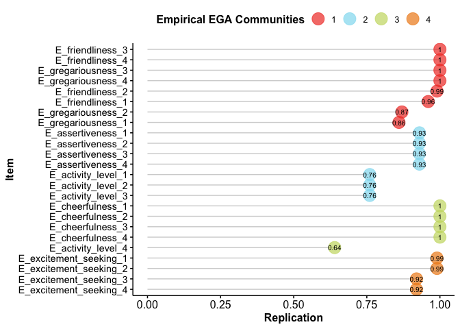

Extroversion
================
Shea @sheacon
2022-12-11

A colleague walks up to you and tells you they’ve collected some survey
data from two different countries. They tell you they think they’ve
developed an excellent Extroversion scale. They are wondering whether
they’ve developed a good scale. You tell them that luckily you’ve taken
a course that introduced you to some statistical tools to evaluate their
survey. They’re stoked and tell you more about their dataset.

They say that they developed the scale with 6 dimensions: activity
level, assertiveness, cheerfulness, excitement-seeking, friendliness,
and gregariousness. For each dimension, they developed 4 items. They had
participants rate each item from 1-5 from “very inaccurate” to “very
accurate” but they reverse-coded items that were inversely related to
Extroversion. The item “avoid crowds,” for example, that was originally
scored “1” was reverse scored to be “5”. They did this reverse coding to
try to ensure all relationships between variables would be positive.

————————- \| ———————————————\|  
ordered_names \| ordered_items \|  
————————- \| ———————————————\|  
E_activity_level_1 \| Am always busy. \|  
E_activity_level_2 \| Am always on the go. \|  
E_activity_level_3 \| Do a lot in my spare time. \|  
E_activity_level_4 \| Like to take it easy. \|  
E_assertiveness_1 \| Take charge. \|  
E_assertiveness_2 \| Try to lead others. \|  
E_assertiveness_3 \| Take control of things. \|  
E_assertiveness_4 \| Wait for others to lead the way. \|  
E_cheerfulness_1 \| Radiate joy. \|  
E_cheerfulness_2 \| Have a lot of fun. \|  
E_cheerfulness_3 \| Love life. \|  
E_cheerfulness_4 \| Look at the bright side of life. \|  
E_excitement_seeking_1 \| Love excitement. \|  
E_excitement_seeking_2 \| Seek adventure. \|  
E_excitement_seeking_3 \| Enjoy being reckless. \|  
E_excitement_seeking_4 \| Act wild and crazy. \|  
E_friendliness_1 \| Make friends easily. \|  
E_friendliness_2 \| Feel comfortable around people. \|  
E_friendliness_3 \| Avoid contacts with others. \|  
E_friendliness_4 \| Keep others at a distance. \|  
E_gregariousness_1 \| Love large parties. \|  
E_gregariousness_2 \| Talk to a lot of different people at parties \|  
E_gregariousness_3 \| Prefer to be alone. \|  
E_gregariousness_4 \| Avoid crowds. \|  
————————- \| ———————————————\|

``` r
# packages
library(dplyr)
library(EGAnet)
library(igraph)
```

``` r
# load data
load("./data/1323.RData")
df <- extraversion
rm(extraversion)
```

> In addition to the survey items, each observation has an id, sex, age,
> year, and country for the participant.

``` r
# eda
colnames(df)
```

    ##  [1] "id"                     "sex"                    "age"                   
    ##  [4] "year"                   "country"                "E_activity_level_1"    
    ##  [7] "E_activity_level_2"     "E_activity_level_3"     "E_activity_level_4"    
    ## [10] "E_assertiveness_1"      "E_assertiveness_2"      "E_assertiveness_3"     
    ## [13] "E_assertiveness_4"      "E_cheerfulness_1"       "E_cheerfulness_2"      
    ## [16] "E_cheerfulness_3"       "E_cheerfulness_4"       "E_excitement_seeking_1"
    ## [19] "E_excitement_seeking_2" "E_excitement_seeking_3" "E_excitement_seeking_4"
    ## [22] "E_friendliness_1"       "E_friendliness_2"       "E_friendliness_3"      
    ## [25] "E_friendliness_4"       "E_gregariousness_1"     "E_gregariousness_2"    
    ## [28] "E_gregariousness_3"     "E_gregariousness_4"

``` r
head(df)
```

> There is one observation per participant. There are 1,115
> observations.

``` r
# counts
nrow(df)
```

    ## [1] 1115

``` r
length(na.omit(unique(df$id)))
```

    ## [1] 1115

1.  Do the number of dimensions match the theoretical dimensions? What
    about the items placed into those dimensions – that is, how well do
    the item placements in the theoretical dimensions match the item
    placement into the empirical dimensions?

> The Exploratory Graph Analysis (EGA) shows five dimensions. This is
> one less than the six of the theoretical design of the survey.

> The theoretical Assertiveness and Excitement dimensions are replicated
> empirically. Friendliness and Gregariousness are combined into the
> same dimension in EGA instead of being theoretically separate. One
> Activity Level item is grouped in the Cheerfulness dimension, and so
> the Activity Level dimension is missing one theoretical item.

> The normalized mutual information score between theoretical and
> empirical is 0.87.

``` r
# for reproducibility of stochastic process
set.seed(20221211)

# only including survey columns (no descriptives)
survey <- df[,6:29]

# perform exploratory graph analysis
ega <- EGA(survey, algorithm = "louvain")
```

<!-- -->

``` r
# summary
summary(ega)
```

Dimension 1 (Friendliness and Gregariousness):

E_friendliness_1  
E_friendliness_2  
E_friendliness_3  
E_friendliness_4  
E_gregariousness_1  
E_gregariousness_2  
E_gregariousness_3  
E_gregariousness_4

Dimension 2 (Cheerfulness w/1 Activity Level):

E_cheerfulness_1  
E_cheerfulness_2  
E_cheerfulness_3  
E_cheerfulness_4  
E_activity_level_4

Dimension 3 (Assertiveness):

E_assertiveness_1  
E_assertiveness_2  
E_assertiveness_3  
E_assertiveness_4

Dimension 4 (Excitement Seeking):

E_excitement_seeking_1  
E_excitement_seeking_2  
E_excitement_seeking_3  
E_excitement_seeking_4

Dimension 5 (Activity Level -1):

E_activity_level_1  
E_activity_level_2  
E_activity_level_3

``` r
# theoretical structure
theo <- c(rep(1,4),rep(2,4),rep(3,4),rep(4,4),rep(5,4),rep(6,4))

# empirical structure
est <- ega$wc
names(est) <- gsub(".Ord1", "", names(est))

# compare structures using NMI
# normalized mutual information
igraph::compare(est, theo, method = "nmi")
```

    ## [1] 0.8716249

2.  How stable is the estimated structure? Can the structure be
    generalized to other datasets? Are there any problematic items?

> 87% of bootstrapped graphs have five dimensions with the remaining 13%
> having four dimensions. Dimensions 2 and 5 are unstable, replicating
> 72% and 87% of the time respectively. The unstable items are all four
> of the Activity Levels. The instability in two of the dimensions may
> suggest poor generalizability.

> Reference: Boostrap Exploratory Graph Analysis -
> <https://www.mdpi.com/2624-8611/3/3/32>

``` r
# bootstrap graphs
set.seed(20221211)
boot_survey <- bootEGA(
  survey
  ,iter = 100
  ,algorithm = "louvain"
  ,type = "parametric"
  ,plot.typicalStructure = FALSE
  ,progress = FALSE
)

# Check the frequency of dimensions
boot_survey$frequency
```

    ##      # of Factors Frequency
    ## [1,]            4      0.13
    ## [2,]            5      0.87

``` r
# Check the *structural consistency* of the dimensions
set.seed(20221211)
consistency <- dimensionStability(boot_survey)
```

<!-- -->

``` r
consistency$dimension.stability$structural.consistency
```

    ##    1    2    3    4    5 
    ## 1.00 0.72 1.00 0.99 0.87

3.  Even if there are no problematic items, are potential issues arising
    from multidimensionality? What about the assumption of local
    independence – do any pairs of variables violate this assumption?

> With a loading threshold of 0.1, there is a multidimensionality
> problem in the variables. Multiple variables have significant loadings
> in multiple dimensions - E_assertiveness_3, E_cheerfulness_2,
> E_excitement_seeking_1, E_excitement_seeking_2, and
> E_gregariousness_1.

> There is also significant local dependence within the theoretical
> groupings. All the Assertiveness variables are dependent, two
> Cheerfulness, and two pairs of the Excitement Seeking. These
> redundancies may be leading to artificial “minor” dimensions.

> Reference: Unique variable analysis - <https://psyarxiv.com/4kra2/>

``` r
# multidimensionality: check loadings

# compute network loadings
loadings <- net.loads(ega)

# set threshold for significant loadings
loading_threshold <- 0.1

# filter loadings matrix
loadings_check <- loadings$std
loadings_check <- loadings_check[order(row.names(loadings_check)), ]
loadings_check[abs(loadings_check) < loading_threshold] <- ''
loadings_check
```

    ##                            5     2     3     4     1
    ## E_activity_level_1     0.299                        
    ## E_activity_level_2      0.25                        
    ## E_activity_level_3     0.193                        
    ## E_activity_level_4                                  
    ## E_assertiveness_1                  0.369            
    ## E_assertiveness_2                  0.345            
    ## E_assertiveness_3      0.102       0.374            
    ## E_assertiveness_4                  0.219            
    ## E_cheerfulness_1             0.179                  
    ## E_cheerfulness_2             0.285       0.113 0.129
    ## E_cheerfulness_3             0.334                  
    ## E_cheerfulness_4             0.296                  
    ## E_excitement_seeking_1       0.106       0.294      
    ## E_excitement_seeking_2   0.1             0.266      
    ## E_excitement_seeking_3                   0.253      
    ## E_excitement_seeking_4                   0.239      
    ## E_friendliness_1                               0.273
    ## E_friendliness_2                               0.265
    ## E_friendliness_3                               0.284
    ## E_friendliness_4                               0.284
    ## E_gregariousness_1                       0.128 0.202
    ## E_gregariousness_2                             0.289
    ## E_gregariousness_3                             0.258
    ## E_gregariousness_4                             0.318

``` r
# check for local dependence
set.seed(20221211)
uva <- UVA(survey)
uva$reduced$merged
```

    ##      Target                   Redundancy_1             Redundancy_2       
    ## LV_6 "E_assertiveness_2"      "E_assertiveness_3"      "E_assertiveness_1"
    ## LV_1 "E_cheerfulness_3"       "E_cheerfulness_4"       ""                 
    ## LV_2 "E_excitement_seeking_1" "E_excitement_seeking_2" ""                 
    ## LV_4 "E_excitement_seeking_3" "E_excitement_seeking_4" ""                 
    ##      Redundancy_3       
    ## LV_6 "E_assertiveness_4"
    ## LV_1 ""                 
    ## LV_2 ""                 
    ## LV_4 ""

## Country Comparison: Pakistan and Taiwan

After some thought, they remember that the data are from two countries
and wondered about a few more things:

``` r
# countries
unique(df$country)
```

    ## [1] "Pakistan" "Taiwan"

``` r
# only including survey columns (no descriptives)
survey_pakistan <- df[df$country == 'Pakistan',6:29]
survey_taiwan <- df[df$country == 'Taiwan',6:29]
```

4.  Do the empirical dimensions for each country match the theoretical?
    How well do they match? What about the similarity between both
    countries’ dimensions?

> The empirical dimensions for the two individual countries each match
> the theoretical less than they did together as one dataset. For
> Pakistan, the NMI is 0.78. For Taiwan, it’s 0.80. That figure was 0.87
> for the whole dataset.

> The countries’ dimensions have similarities and differences. Both see
> Assertiveness items group together, but that dimension includes
> Activity Level items 1-3 for Taiwan whereas they are their own
> dimension for Pakistan. Gregariousness and Friendliness items group
> together for both countries. For Pakistan, the remaining dimension is
> a combination of Excitement Seeking and Cheerfulness (plus one
> Activity Level). In Taiwan, Excitement Seeking and Cheerfulness are
> two separate dimensions.

### Pakistan

``` r
# perform exploratory graph analysis
set.seed(20221211)
ega_pakistan <- EGA(survey_pakistan, algorithm = "louvain")
```

<!-- -->

``` r
# theoretical structure
theo <- c(rep(1,4),rep(2,4),rep(3,4),rep(4,4),rep(5,4),rep(6,4))

# empirical structure
est <- ega_pakistan$wc
names(est) <- gsub(".Ord1", "", names(est))

# compare structures using NMI
igraph::compare(est, theo, method = "nmi")
```

    ## [1] 0.7773804

### Taiwan

``` r
# perform exploratory graph analysis
set.seed(20221211)
ega_taiwan <- EGA(survey_taiwan, algorithm = "louvain")
```

<!-- -->

``` r
# theoretical structure
theo <- c(rep(1,4),rep(2,4),rep(3,4),rep(4,4),rep(5,4),rep(6,4))

# empirical structure
est <- ega_taiwan$wc
names(est) <- gsub(".Ord1", "", names(est))

# compare structures using NMI
igraph::compare(est, theo, method = "nmi")
```

    ## [1] 0.8001109

5.  Are the structures for each country stable? What about problematic
    items? Is local independence violated?

> The dimension structural stability for both contries is not great. For
> Pakistan, 0.4 of the bootstrapped EGA graphs had four dimensions, 0.56
> five dimensions, and the remaining three dimensions. For Taiwan, 0.7
> had four dimensions and 0.3 five dimensions.

> The dimension structural consistency is also challenged in both
> countries. For Pakistan, the inconsistency is mostly focused in the
> first dimension, which only replicates 0.14 of the time. It appears
> that might be due to Cheerfulness and Excitement Seeking sometimes
> forming one dimension or two separate. Pakistan’s fourth dimensions
> replicates 0.89 of the time. For Taiwan, the inconsistency is spread
> across the four dimensions - 0.86, 0.70, 0.64, and 0.91 respectively.

> There are items with problematic stability for both countries. For
> Pakistan, the Excitement Seeking and fourth Activity Level have very
> low stability. Taiwan’s item instability is lower by spread across
> more items - namely the Activity Levels and some Gregariousness, as
> well as others.

> There is evidence of multidimensionality in items for both countries.
> For Pakistan, E_assertiveness_3, E_cheerfulness_2,
> E_excitement_seeking_2, and E_gregariousness_1 have significant
> loadings across dimensions. For Taiwan, E_assertiveness_2,
> E_cheerfulness_2, E_excitement_seeking_2, and E_gregariousness_1 have
> significant loadings across dimensions.

> According to Unique Variable Analysis, local independence is violated
> in survey items for both countries. In Pakistan, there is local
> dependency within Assertiveness and Excitement Seeking. In Taiwan,
> there is local dependency within Cheerfulness.

### Pakistan

``` r
# bootstrap graphs
set.seed(20221211)
boot_survey_pakistan <- bootEGA(
  survey_pakistan
  ,iter = 100
  ,algorithm = "louvain"
  ,type = "parametric"
  ,plot.typicalStructure = FALSE
  ,progress = FALSE
)

# frequency of dimensions
boot_survey_pakistan$frequency
```

    ##      # of Factors Frequency
    ## [1,]            3      0.04
    ## [2,]            4      0.41
    ## [3,]            5      0.55

``` r
# Check the *structural consistency* of the dimensions
set.seed(20221211)
consistency <- dimensionStability(boot_survey_pakistan)
```

<!-- -->

``` r
consistency$dimension.stability$structural.consistency
```

    ##    1    2    3    4 
    ## 0.14 0.99 1.00 0.89

``` r
# multidimensionality: check loadings

# compute network loadings
loadings_pakistan <- net.loads(ega_pakistan)

# threshold for significant loadings
loading_threshold <- 0.1

# filter loadings matrix
loadings_check <- loadings$std
loadings_check <- loadings_check[order(row.names(loadings_check)), ]
loadings_check[abs(loadings_check) < loading_threshold] <- ''
loadings_check
```

    ##                            5     2     3     4     1
    ## E_activity_level_1     0.299                        
    ## E_activity_level_2      0.25                        
    ## E_activity_level_3     0.193                        
    ## E_activity_level_4                                  
    ## E_assertiveness_1                  0.369            
    ## E_assertiveness_2                  0.345            
    ## E_assertiveness_3      0.102       0.374            
    ## E_assertiveness_4                  0.219            
    ## E_cheerfulness_1             0.179                  
    ## E_cheerfulness_2             0.285       0.113 0.129
    ## E_cheerfulness_3             0.334                  
    ## E_cheerfulness_4             0.296                  
    ## E_excitement_seeking_1       0.106       0.294      
    ## E_excitement_seeking_2   0.1             0.266      
    ## E_excitement_seeking_3                   0.253      
    ## E_excitement_seeking_4                   0.239      
    ## E_friendliness_1                               0.273
    ## E_friendliness_2                               0.265
    ## E_friendliness_3                               0.284
    ## E_friendliness_4                               0.284
    ## E_gregariousness_1                       0.128 0.202
    ## E_gregariousness_2                             0.289
    ## E_gregariousness_3                             0.258
    ## E_gregariousness_4                             0.318

``` r
# check for local dependence
set.seed(20221211)
uva <- UVA(survey_pakistan)
uva$reduced$merged
```

    ##      Target                   Redundancy_1             Redundancy_2       
    ## LV_1 "E_assertiveness_3"      "E_assertiveness_1"      "E_assertiveness_2"
    ## LV_2 "E_excitement_seeking_3" "E_excitement_seeking_4" ""                 
    ## LV_3 "E_excitement_seeking_1" "E_excitement_seeking_2" ""

### Taiwan

``` r
# bootstrap graphs
set.seed(20221211)
boot_survey_taiwan <- bootEGA(
  survey_taiwan
  ,iter = 100
  ,algorithm = "louvain"
  ,type = "parametric"
  ,plot.typicalStructure = FALSE
  ,progress = FALSE
)

# frequency of dimensions
boot_survey_taiwan$frequency
```

    ##      # of Factors Frequency
    ## [1,]            4       0.7
    ## [2,]            5       0.3

``` r
# Check the *structural consistency* of the dimensions
set.seed(20221211)
consistency <- dimensionStability(boot_survey_taiwan)
```

<!-- -->

``` r
consistency$dimension.stability$structural.consistency
```

    ##    1    2    3    4 
    ## 0.86 0.69 0.64 0.91

``` r
# multidimensionality: check loadings

# compute network loadings
loadings_taiwan <- net.loads(ega_taiwan)

# threshold for significant loadings
loading_threshold <- 0.1

# filter loadings matrix
loadings_check <- loadings_taiwan$std
loadings_check <- loadings_check[order(row.names(loadings_check)), ]
loadings_check[abs(loadings_check) < loading_threshold] <- ''
loadings_check
```

    ##                            2     3     4     1
    ## E_activity_level_1     0.186                  
    ## E_activity_level_2     0.209                  
    ## E_activity_level_3     0.186                  
    ## E_activity_level_4     0.105                  
    ## E_assertiveness_1      0.335                  
    ## E_assertiveness_2      0.282         0.1      
    ## E_assertiveness_3      0.313                  
    ## E_assertiveness_4      0.208                  
    ## E_cheerfulness_1             0.205            
    ## E_cheerfulness_2             0.305 0.104 0.153
    ## E_cheerfulness_3             0.346            
    ## E_cheerfulness_4             0.309            
    ## E_excitement_seeking_1             0.253      
    ## E_excitement_seeking_2 0.112       0.239      
    ## E_excitement_seeking_3             0.196      
    ## E_excitement_seeking_4             0.227      
    ## E_friendliness_1              0.11       0.284
    ## E_friendliness_2             0.101       0.239
    ## E_friendliness_3                         0.254
    ## E_friendliness_4                         0.291
    ## E_gregariousness_1                 0.135 0.243
    ## E_gregariousness_2                        0.25
    ## E_gregariousness_3                       0.229
    ## E_gregariousness_4                       0.283

``` r
# check for local dependence
set.seed(20221211)
uva <- UVA(survey_taiwan)
uva$reduced$merged
```

    ##      Target             Redundancy_1      
    ## LV_1 "E_cheerfulness_3" "E_cheerfulness_4"

------------------------------------------------------------------------

Finally, they say they have two important questions that they need to
report to their boss. First, they want to develop an experiment to tap
into Extroversion similarities or differences between the two countries.
They wonder if you might have some input based on your results.

6.  Do the empirical structures of the countries differ statistically
    from one another? If there are items that differ, what are they?
    Speculate on the mechanisms behind the differences or lack of
    differences between the groups and think about how these differences
    might be evaluated in an experiment (we haven’t covered experimental
    design yet but speculate about a task that these two groups could
    perform that might give you a behavioral measure of this
    difference).

> There are significant differences in E_gregariousness_1 and
> E_assertiveness_3.

> For E_gregariousness_1 (“Love large parties”), its network loadings
> indicate that it has greater explanatory power in Taiwan than
> Pakistan. This suggests that there is greater variation in the
> responses to this survey item in Taiwan. The attitudes towards large
> parties in Pakistani culture may be more homogeneous.

> For E_assertiveness_3 (“Take control of things”), its network loadings
> indiciate it has greater explanatory power in Pakistan than Taiwan.
> This suggests that there is greater variation in the responses to this
> survey item in Pakistan. The attitudes towards taking control in
> Taiwanese culture may be more homogeneous.

> Reference: Measurement Invariance - <https://psyarxiv.com/j4rx9/>

> “Establishing measurement invariance (MI) is vital when using any
> psychological measurement to ensure applicability and comparability
> across groups (or time points). If MI is violated, mean differences
> among groups could be due to the measurement rather than true
> differences in the latent variable.”

> I’m not entirely comfortable making speculative generalizations about
> entire peoples and cultures I don’t know much about. Different
> cultures encourage and discourage different personality traits in
> socialization. We are perhaps discovering the results of some of those
> cultural differences. Without examining Pakistani and Taiwanese
> culture in depth, I’m not sure what the cultural roots of differences
> in affinity to “large parties” or “taking control of things” might be.

> Given that the differences are in gregariousness and assertiveness,
> I’d want to collect data that exposes further differences in those
> personality traits. I’d be interested in the individuals response to
> new questions about “large parties” and “taking control of things”,
> but also how their culture or social pressures might influence that.
> This could be evaluated in a survey where there are two groups of
> questions, one about large parties and another about taking control.
> Within these two groups of questions, I’d want to ask about the
> individual’s preferences but also what they think the preference of
> “most people” is (to capture their view of cultural expectations).
> This data could be used to evaluate differences in personal
> preferences and how that compares to the culture (or perceived
> cultural norm).

> Besides collecting the survey data, to make it an experiment there
> needs to be a manipulated variable. In this case, I’d like to
> manipulate a variable to capture the effect of cultural norms that
> might be subconscious. For one group of participants I would ask the
> questions relating to the preferences of “most people” before asking
> them about their personal preferences. For the other group I’d ask in
> the reverse order - personal then cultural. My thinking is that those
> asked about the preferences of most people might subconsciously alter
> their personal preferences to conform to cultural norms more, having
> been primed to consider them. The response differences could be
> examined statistically.

``` r
# check for heterogeneous sample

# split by country
country <- df$country

# measurement invariance
set.seed(20221211)
ega_mi <- invariance(data = df[,6:29], groups = country, progress = FALSE)

# summary
summary(ega_mi)
```

    ##                    Node Membership Difference     p  sig
    ##        E_friendliness_1          1     -0.020 0.558 n.s.
    ##        E_friendliness_2          1      0.053 0.160 n.s.
    ##        E_friendliness_3          1      0.033 0.460 n.s.
    ##        E_friendliness_4          1     -0.016 0.656 n.s.
    ##      E_gregariousness_1          1     -0.071 0.050    *
    ##      E_gregariousness_2          1      0.054 0.120 n.s.
    ##      E_gregariousness_3          1      0.038 0.284 n.s.
    ##      E_gregariousness_4          1      0.047 0.178 n.s.
    ##      E_activity_level_4          2      0.019 0.588 n.s.
    ##        E_cheerfulness_1          2     -0.059 0.122 n.s.
    ##        E_cheerfulness_2          2     -0.053 0.300 n.s.
    ##        E_cheerfulness_3          2     -0.014 0.762 n.s.
    ##        E_cheerfulness_4          2     -0.049 0.294 n.s.
    ##  E_excitement_seeking_1          3      0.030 0.530 n.s.
    ##  E_excitement_seeking_2          3      0.000 1.000 n.s.
    ##  E_excitement_seeking_3          3      0.079 0.058    .
    ##  E_excitement_seeking_4          3      0.025 0.604 n.s.
    ##       E_assertiveness_1          4      0.049 0.346 n.s.
    ##       E_assertiveness_2          4      0.012 0.820 n.s.
    ##       E_assertiveness_3          4      0.102 0.044    *
    ##       E_assertiveness_4          4     -0.069 0.086    .
    ##      E_activity_level_1          5      0.056 0.300 n.s.
    ##      E_activity_level_2          5     -0.057 0.334 n.s.
    ##      E_activity_level_3          5      0.014 0.816 n.s.
    ## ---
    ## Signif. code: 0 '***' 0.001 '**' 0.01 '*' 0.05 '.' 0.1 'n.s.' 1

Second, they are developing an ad campaign that is tailored to different
generations. They think that millennials might be more extroverted than
boomers but they aren’t sure if this is true in each country. They would
like training and testing data to know how well they can expect the
results to generalize.

7.  Can age be predicted by the dimensions of Extroversion for each
    country (treat age as continuous)? Do the dimensions that predict
    age differ between the countries? How well can the training model be
    expected to generalize (report correlation between the predicted and
    observed results of the test data)

> Age cannot be predicted well by extroversion in either Pakistan or
> Taiwan. The R-squared on the training data is 0.05 and 0.06. The
> correlation between predicted and observed results is very poor in
> Pakistan and Taiwan, 0.22 and 0.20.

> Further, the significant variables/dimensions in the two models are
> different. In Pakistan, it’s the two dimensions of
> Cheerfulness/Excitement and Gregariousness/Friendliness. In Taiwan,
> it’s the two dimensions of Assertiveness/Activity and Excitement.

### Pakistan

``` r
# age stats: pakistan
summary(df$age[df$country == 'Pakistan'])
```

    ##    Min. 1st Qu.  Median    Mean 3rd Qu.    Max. 
    ##   13.00   20.00   23.00   24.65   27.00   99.00

``` r
 # perform exploratory graph analysis
ega_pakistan <- EGA(survey_pakistan, algorithm = "louvain")
```

<!-- -->

``` r
# compute network scores
scores <- net.scores(ega_pakistan, data = survey_pakistan, impute = 'none')
```

``` r
# create dataset for regression
pakistan_age <- data.frame(
  age = df$age[df$country == 'Pakistan'],
  X1 = scores$scores$std.scores$`1`,
  X2 = scores$scores$std.scores$`2`,
  X3 = scores$scores$std.scores$`3`,
  X4 = scores$scores$std.scores$`4`
)

# remove NAs
pakistan_age <- na.omit(pakistan_age)
```

``` r
# create train and test datasets
set.seed(20221211)
train_index <- sample(1:nrow(pakistan_age), round(nrow(pakistan_age) * 0.70), replace = FALSE)
test_index <- setdiff(1:nrow(pakistan_age), train_index)

train_pakistan <- pakistan_age[train_index,]
test_pakistan <- pakistan_age[test_index,]
```

``` r
# regression on training data
pakistan_lm <- lm(
  age ~ X1 + X2 + X3 + X4,
  data = train_pakistan,
)

# report
summary(pakistan_lm)
```

    ## 
    ## Call:
    ## lm(formula = age ~ X1 + X2 + X3 + X4, data = train_pakistan)
    ## 
    ## Residuals:
    ##      Min       1Q   Median       3Q      Max 
    ## -14.1779  -4.1758  -0.9758   2.7626  30.7815 
    ## 
    ## Coefficients:
    ##             Estimate Std. Error t value Pr(>|t|)    
    ## (Intercept)  24.2420     0.3405  71.199  < 2e-16 ***
    ## X1           -2.3993     0.5284  -4.541 7.54e-06 ***
    ## X2            1.4044     0.4644   3.024  0.00266 ** 
    ## X3            0.6228     0.5167   1.205  0.22878    
    ## X4            0.7649     0.5166   1.481  0.13950    
    ## ---
    ## Signif. codes:  0 '***' 0.001 '**' 0.01 '*' 0.05 '.' 0.1 ' ' 1
    ## 
    ## Residual standard error: 6.674 on 380 degrees of freedom
    ## Multiple R-squared:  0.0564, Adjusted R-squared:  0.04647 
    ## F-statistic: 5.678 on 4 and 380 DF,  p-value: 0.0001899

``` r
# model test data
predicted_pakistan <- predict(pakistan_lm, newdata = test_pakistan, type = "response")

# correlation between test actual and predicted
cor(test_pakistan$age,predicted_pakistan)
```

    ## [1] 0.2205406

### Taiwan

``` r
# age stats: taiwan
summary(df$age[df$country == 'Taiwan'])
```

    ##    Min. 1st Qu.  Median    Mean 3rd Qu.    Max. 
    ##   12.00   20.00   25.00   25.93   29.00   60.00

``` r
 # perform exploratory graph analysis
ega_taiwan <- EGA(survey_taiwan, algorithm = "louvain")
```

<!-- -->

``` r
# compute network scores
scores <- net.scores(ega_taiwan, data = survey_taiwan)
```

    ## Warning in net.scores(ega_taiwan, data = survey_taiwan): Argument 'impute' is
    ## missing. No imputation will be used.

``` r
# create regression dataset
age_taiwan <- data.frame(
  age = df$age[df$country == 'Taiwan'],
  X1 = scores$scores$std.scores$`1`,
  X2 = scores$scores$std.scores$`2`,
  X3 = scores$scores$std.scores$`3`,
  X4 = scores$scores$std.scores$`4`
)

# remove NAs
age_taiwan <- na.omit(age_taiwan)
```

``` r
# create train and test datasets
set.seed(20221211)
train_index <- sample(1:nrow(age_taiwan), round(nrow(age_taiwan) * 0.70), replace = FALSE)
test_index <- setdiff(1:nrow(age_taiwan), train_index)

train_taiwan <- age_taiwan[train_index,]
test_taiwan <- age_taiwan[test_index,]
```

``` r
# perform regression on training data
taiwan_lm <- lm(
  age ~ X1 + X2 + X3 + X4,
  data = train_taiwan,
)

# report
summary(taiwan_lm)
```

    ## 
    ## Call:
    ## lm(formula = age ~ X1 + X2 + X3 + X4, data = train_taiwan)
    ## 
    ## Residuals:
    ##     Min      1Q  Median      3Q     Max 
    ## -17.182  -5.404  -1.286   3.187  31.898 
    ## 
    ## Coefficients:
    ##             Estimate Std. Error t value Pr(>|t|)    
    ## (Intercept)  26.1092     0.3940  66.266  < 2e-16 ***
    ## X1            0.3741     0.6633   0.564 0.573049    
    ## X2            1.8716     0.5329   3.512 0.000496 ***
    ## X3           -0.3917     0.6607  -0.593 0.553623    
    ## X4           -1.9081     0.5037  -3.788 0.000176 ***
    ## ---
    ## Signif. codes:  0 '***' 0.001 '**' 0.01 '*' 0.05 '.' 0.1 ' ' 1
    ## 
    ## Residual standard error: 7.834 on 391 degrees of freedom
    ## Multiple R-squared:  0.05484,    Adjusted R-squared:  0.04517 
    ## F-statistic: 5.671 on 4 and 391 DF,  p-value: 0.0001907

``` r
# model test data
predicted_taiwan <- predict(taiwan_lm, newdata = test_taiwan, type = "response")

# correlation between test actual and predicted
cor(test_taiwan$age,predicted_taiwan)
```

    ## [1] 0.1974852
